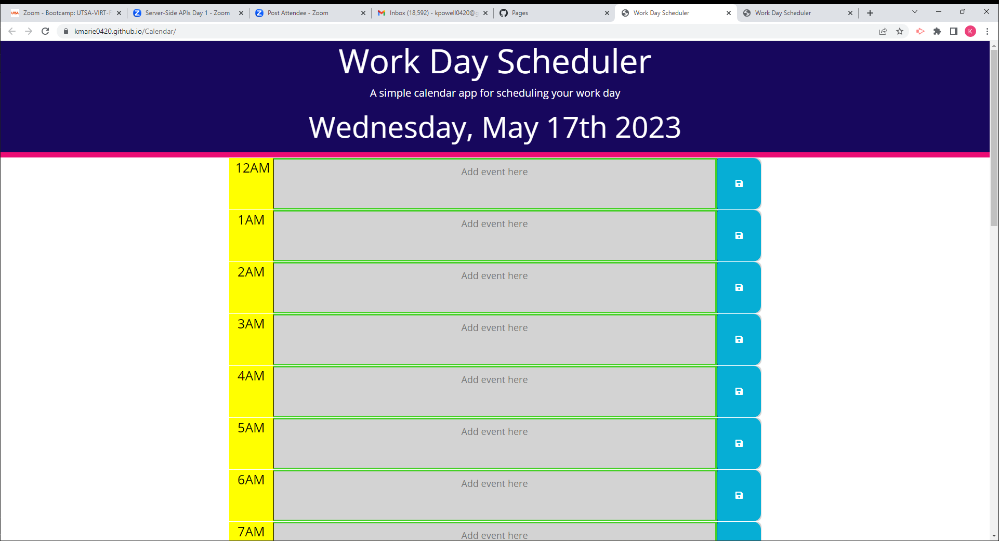
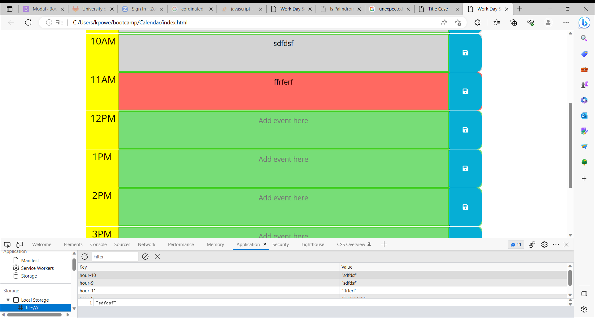

# Calendar

Simple Calendar Application

## User Story

AS AN employee with a busy schedule
I WANT to add important events to a daily planner
SO THAT I can manage my time effectively

## Acceptance Criteria

GIVEN I am using a daily planner to create a schedule
WHEN I open the planner
THEN the current day is displayed at the top of the calendar
WHEN I scroll down
THEN I am presented with timeblocks for standard business hours
WHEN I view the timeblocks for that day
THEN each timeblock is color coded to indicate whether it is in the past, present, or future
WHEN I click into a timeblock
THEN I can enter an event
WHEN I click the save button for that timeblock
THEN the text for that event is saved in local storage
WHEN I refresh the page
THEN the saved events persist

## Description

A Simple Calendar App that allows working individuals to save events to a working schedule. 
A simple application that is for all times of the day.
Effective, Organized, and Straightforward.
The app provides the current date.
The page corresponds to the current time by past, present, future; color coordinated.
Formatted by HTML, CSS, Javascript, moment.js, Bootstrap, GoogleApi's, dayjs.js, and jQuery. 

## Images

.png)

## Repository

https://github.com/kmarie0420/Calendar

## Deployment

https://kmarie0420.github.io/Calendar/

## Credits

https://stackoverflow.com/questions/44609306/moment-is-not-defined-using-moment-js
